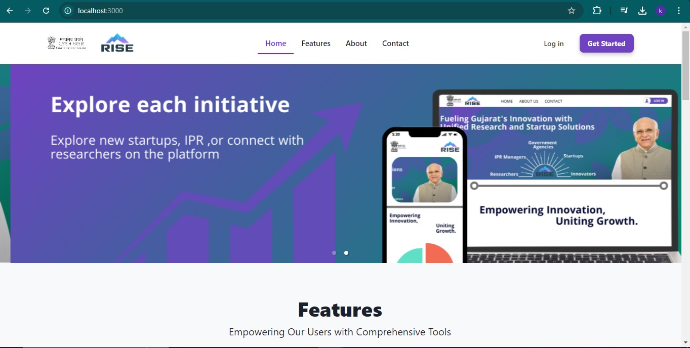
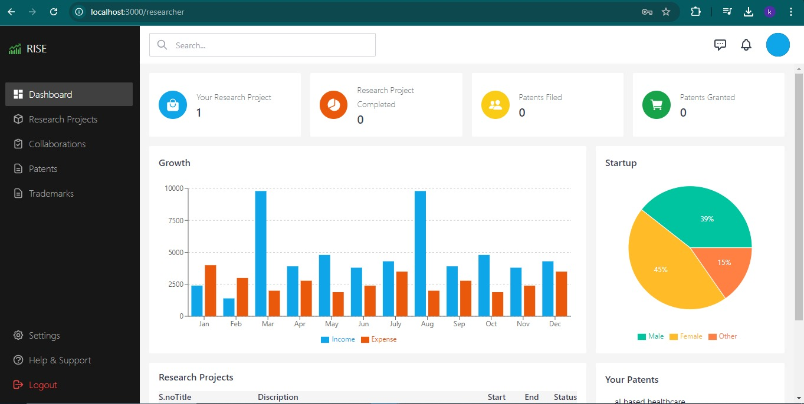
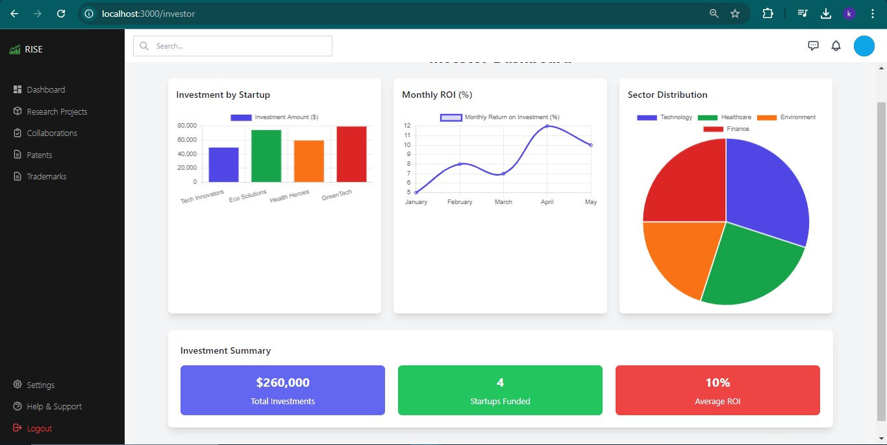
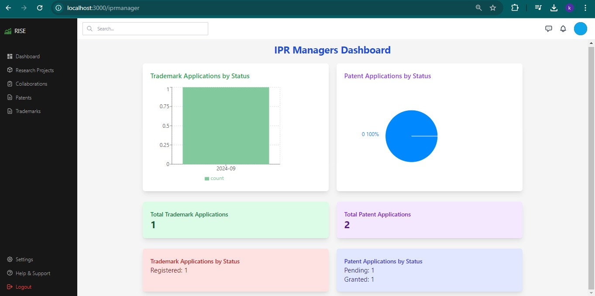
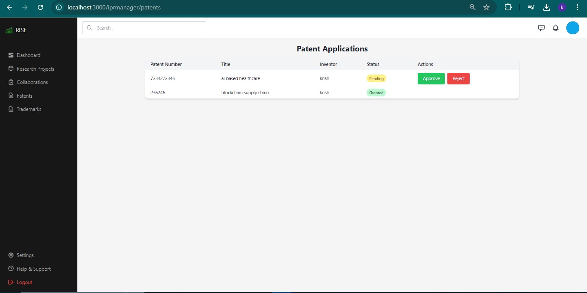

# AI-Enhanced Innovation Management System for Gujarat

This README provides an overview of the project, including team details, relevant links, tasks completed, tech stack, key features, and steps to run the project locally.

## Team Details

*Team Name:* RISE

*Team Leader:* [@LeoAB03](https://github.com/LeoAB03)

*Team Members:*

- *Abhigyan Bhardwaj* - 2022UMV7630 - [@LeoAB03](https://github.com/LeoAB03)
- *Ayush Kumar* - 2022UMV7644 - [@ak35Ayush](https://github.com/ak35Ayush)
- *Ayush Jain* - 2022UEA6548 - [@ayush14189](https://github.com/ayush14189)
- *Aishwina Nainwal* - 2023UEC2605 - [@AishwinaNainwal](https://github.com/AishwinaNainwal)
- *Krish Sharma* - 2022UEA6506 - [@Krishsh93](https://github.com/Krishsh93)
- *Ankit Sneh* - 2022UEA7618 - [@ENDOMINOUSANK](https://github.com/ENDOMINOUSANK)

## Project Links

- *Final SIH Presentation:* [Final SIH Presentation](https://github.com/Krishsh93/sih/blob/main/Team_RISE_MAIN_SIH.pdf)
- *Video Demonstration:* [Watch Video](https://youtu.be/hditSaAN_jo)
- *Live Deployment:* [Deploy]()We will deploy it shortly
- *Source Code:* [GitHub Repository](https://github.com/Krishsh93/sih)
- *Additional Resources:* [Other Relevant Links]()
## Installation and Setup

### 1. *Clone the Repository*

   ```bash
   git clone https://github.com/Krishsh93/sih
   cd backend
   ```
   
### 2. *Set Up Environment Variables*

   Create a ```.env``` file in the root directory and add the following variables:

   ``` bash
   MONGO_URI=<your-mongodb-connection-string>
   PORT=5000 # or any port number of your choice
   ```
   
### 3. *Install Server Dependencies*

- Navigate to the backend (or server) directory and run:

   ```bash
   cd backend
   npm install
   ```
   

### 4. *Run the Server*

   Start the backend server:

   ```bash
   npm run server

   ```

   This command will run the server using ```nodemon``` (if configured) and listen on the port defined in your ```.env``` file.

### 5. *Install Client Dependencies*

   Open a new terminal window, navigate to the frontend (or client) directory, and run:

   ```bash
   cd openshop-analytics-dashboard
   npm install
   ```

### 6. *Run the Client*

   Start the React client:

   ```bash
   npm start
   ```
   
   This command will run the React app on ```http://localhost:3000``` by default.

### 7. *Open in Browser*

   Open your web browser and go to ```http://localhost:3000``` to see the application running locally.

## Background


Gujarat has established itself as a pioneer in fostering innovation and entrepreneurship. The state houses numerous research institutions, start-ups, and innovation hubs that drive economic growth and technological advancement. However, the current systems for monitoring research activities, managing intellectual property rights (IPR), tracking innovation development, and overseeing start-up growth are fragmented and inefficient. The information is scattered across different organizations and departments, leading to difficulties in data accessibility, transparency, resource allocation, and overall management.

### Challenges:
- Fragmented systems across various departments.
- Lack of data accessibility and transparency.
- Inefficient resource allocation for research and innovation.

## Proposed Solution: Comprehensive Web Application

The proposed solution is a **centralized web platform** designed to streamline the management of research, IPR, innovation, and start-up growth in Gujarat. This platform will unify the scattered processes, improving efficiency, transparency, and productivity. It will cater to the needs of various stakeholders such as researchers, innovators, policy-makers, investors, and IPR professionals.

---

## Detailed Description of Features

### 1. **Unified Data Repository**
A centralized database where information related to research projects, patents, innovations, and start-up activities will be stored. The system ensures that data is easily accessible to authorized users and eliminates fragmentation.
- **Benefits**: Data consolidation, easy access for all stakeholders.

---

### 2. **Transparent Monitoring**
Provides tools for stakeholders to track the progress of research, innovations, and start-ups. This system ensures transparency in monitoring key outcomes and developments in various projects.
- **Benefits**: Real-time tracking, greater transparency.

---

### 3. **Efficient Resource Allocation**
The platform provides mechanisms for allocating resources like funding and mentorship based on real-time data. It uses data insights to optimize resource distribution across projects and start-ups.
- **Benefits**: Better utilization of resources, optimized decision-making.

---

### 4. **IPR Management**
A streamlined process for managing intellectual property rights, including filing patent applications, tracking status updates, and ensuring protection of intellectual property.
- **Benefits**: Simplified patent filing, efficient IP protection.

---

### 5. **Support for Innovators and Start-ups**
Access to mentorship, resources, and support services through the platform, enhancing the growth potential of innovators and entrepreneurs.
- **Benefits**: Holistic support for innovation, improved start-up success.

---

### 6. **Collaboration Tools**
The platform provides features that promote collaboration among researchers, innovators, policy makers, and investors, creating a cohesive innovation ecosystem.
- **Benefits**: Better collaboration, faster innovation cycles.

---

### 7. **Data-Driven Insights**
The platform offers advanced analytics and reporting tools, enabling policymakers and funding agencies to make informed decisions based on real-time data.
- **Benefits**: Data-driven decision-making, policy formulation support.

---

## Target Users

The application is designed for a diverse range of users, each benefiting from its unique functionalities:

### - **Researchers and Academics**:  
  Manage and track research projects, collaborations, and funding.

### - **Innovators and Entrepreneurs**:  
  Access resources and information about innovations and start-ups.

### - **Policy Makers and Government Bodies**:  
  Leverage data insights for informed decision-making and policy formulation.

### - **Investors and Funding Agencies**:  
  Evaluate and support promising research projects and start-ups with transparent systems.

### - **IPR Professionals**:  
  Manage patent applications and intellectual property efficiently.

---

## Expected Outcomes

The implementation of this web application is expected to yield significant benefits for Gujarat’s innovation and entrepreneurial ecosystem:

- **Centralized Data Repository**: Consolidation of all relevant data into a unified platform, reducing fragmentation.
- **Increased Transparency**: Enhanced transparency in tracking project progress and outcomes.
- **Improved Resource Utilization**: Efficient allocation of resources, ensuring optimized support for research and start-ups.
- **Faster Innovation Cycles**: Improved collaboration and support systems, leading to faster innovation processes.
- **Economic Growth**: Higher start-up success rates and increased innovation outputs, contributing to Gujarat's economic growth.
- **Enhanced IPR Protection**: Streamlined IPR management, reducing delays and ensuring better protection for innovators.

---

## Technology Stack

- **Frontend**: React.js for building a responsive and intuitive user interface.
- **Backend**: Node.js for handling server-side logic and APIs.
- **Database**: MongoDB for storing and managing data related to research, IPR, and start-ups.
- **AI Models**: Integrated tools for data-driven insights and recommendations.
- **Deployment**: Docker for containerization and scalable deployment.

---

## Prerequisites

Before running the application locally, ensure you have the following installed:

- **Node.js** (v14 or later)
- **MongoDB** (or any other database)
- **Python 3.7** or later (for AI models)
- **pip** (Python package manager)
- **Virtualenv** (recommended)
- **Git** (for version control)

---

## Conclusion

This comprehensive web platform aims to revolutionize Gujarat’s innovation ecosystem by providing a more efficient, transparent, and supportive environment for research, IPR management, innovation, and start-up growth. By addressing existing challenges and leveraging modern technology, the platform will significantly enhance the state’s capacity to foster and sustain innovation and entrepreneurship.
